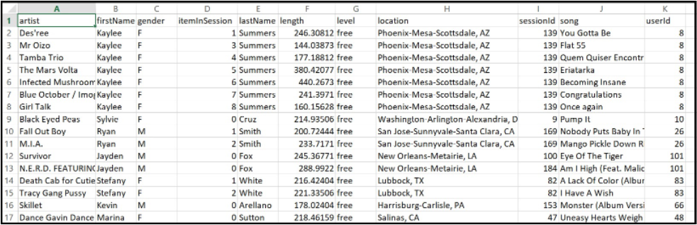

# Project: Data Modeling with Cassandra
Udacity Data Engineering ND project 2


## Summary
* [Purpose of project](#Purpose-of-project)
* [Dataset](#Dataset)
* [Project structure](#Project-structure)
* [Quary example](#quary-example)

## Purpose of project
A startup called Sparkify wants to analyze the data they've been collecting on songs and user activity on their new music streaming app. The analysis team is particularly interested in understanding what songs users are listening to. Currently, there is no easy way to query the data to generate the results, since the data reside in a directory of CSV files on user activity on the app. This goal of the project is to build an **Apache Cassandra database** can create queries on song play data.

## Dataset
The dataset is `event_data` which is a directory of csv files partitioned by date.
Here are example of filepaths to two files in the dataset:

```
event_data/2018-11-08-events.csv
event_data/2018-11-09-events.csv
```
Part I of `Project_1B_Project_Template.ipynb` processes the files to create the data file csv that will be used for Apache Casssandra tables:


## Project structure

  * `Project_1B_Project_Template.ipynb` - ETL pipeline
  * `event_datafile_new.csv` - aggregated data file of `event_data` set.

## Queries for data modeling
*1. Give me the artist, song title and song's length in the music app history that was heard during  sessionId = 338, and itemInSession  = 4.*

*2. Give me only the following: name of artist, song (sorted by itemInSession) and user (first and last name) for userid = 10, sessionid = 182*

*3. Give me every user name (first and last) in my music app history who listened to the song 'All Hands Against His Own'*
