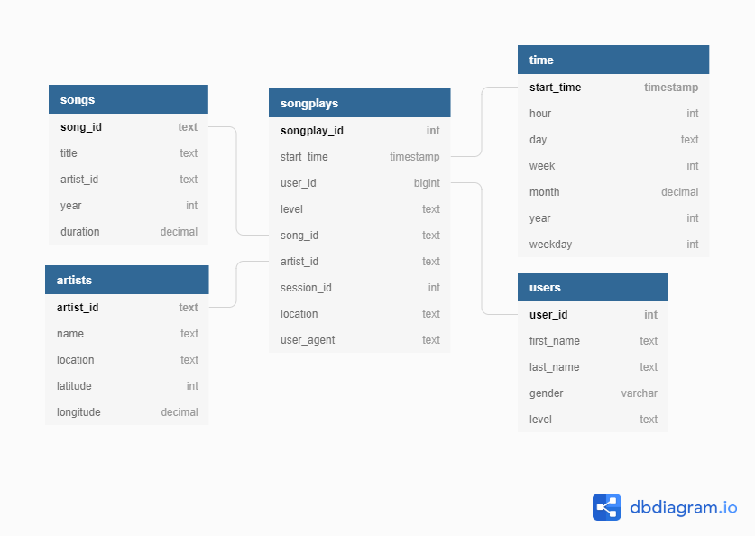

# Project: Data Data Warehouse
Udacity Data Engineering ND project 3


## Summary
* [Purpose of project](#Purpose-of-project)
* [Dataset](#Dataset)
* [Schema for Song Play Analysis](#Schema-for-Song-Play-Analysis)
* [ETL Pipeline](#ETL-Pipeline)
* [Project Structure](#Project-Structure)

## Purpose of project
A music streaming startup, Sparkify, has grown their user base and song database and want to move their processes and data onto the cloud. Their data resides in S3, in a directory of JSON logs on user activity on the app, as well as a directory with JSON metadata on the songs in their app. I built an ETL pipeline that extracts their data from S3, staged them in Redshift, and transformed data into a set of dimensional tables for their analytics team to continue finding insights into what songs their users are listening to.

## Dataset

### Song Dataset
```
Song data: s3://udacity-dend/song_data
Log data: s3://udacity-dend/log_data
Log data json path: s3://udacity-dend/log_json_path.json
```
The first dataset is a subset of real data from the Million Song Dataset. Each file is in JSON format and contains metadata about a song and the artist of that song. The files are partitioned by the first three letters of each song's track ID. For example, here are file paths to two files in this dataset.
```
song_data/A/B/C/TRABCEI128F424C983.json
song_data/A/A/B/TRAABJL12903CDCF1A.json
```

And below is an example of what a single song file, TRAABJL12903CDCF1A.json, looks like.
```
{"num_songs": 1, "artist_id": "ARJIE2Y1187B994AB7", "artist_latitude": null, "artist_longitude": null, "artist_location": "", "artist_name": "Line Renaud", "song_id": "SOUPIRU12A6D4FA1E1", "title": "Der Kleine Dompfaff", "duration": 152.92036, "year": 0}
```

### Log Dataset
The second dataset consists of log files in JSON format generated by this event simulator based on the songs in the dataset above. These simulate app activity logs from an imaginary music streaming app based on configuration settings.

The log files in the dataset are partitioned by year and month. For example, here are file paths to two files in this dataset.

```
log_data/2018/11/2018-11-12-events.json
log_data/2018/11/2018-11-13-events.json
```
And below is an example of what the data in a log file, 2018-11-12-events.json, looks like.


## Schema for Song Play Analysis



### Fact Table
1. **songplays**  - records in event data associated with song plays i.e. records with page NextSong
  * songplay_id, start_time, user_id, level, song_id, artist_id, session_id, location, user_agent

### Dimension Tables
2. **users** - users in the app
  * user_id, first_name, last_name, gender, level
3. **songs** - songs in music database
  * song_id, title, artist_id, year, duration
4. **artists** - artists in music database
  * artist_id, name, location, lattitude, longitude
5. **time** - timestamps of records in songplays broken down into specific units
 * start_time, hour, day, week, month, year, weekday


## ETL Pipeline
* Create tables to store the data from 'S3'.
* Load the data from `S3` to staging tables in the `Redshift Cluster`.
* Insert data into fact and dimension tables from the staging tables.

## Project Structure

* `create_tables.py` - Create tables. Will drop tables if they already exist.
* `etl.py` - Extract `JSON` data from the `S3` and load them to `Redshift`.
* `sql_queries.py` - Contains sql statements for creating, dropping, inserting and copying.
* `dhw.cfg` - Holds information for `Redshift`, `IAM` and `S3`
